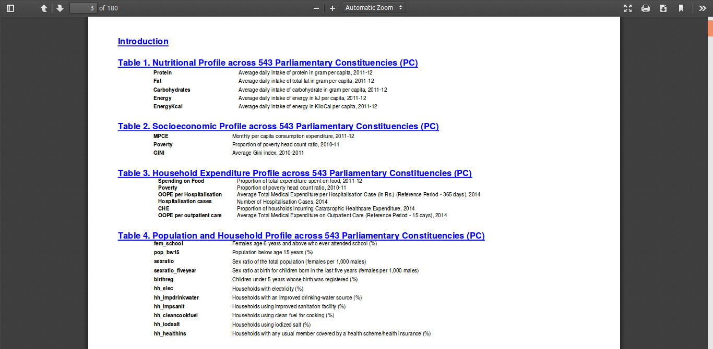
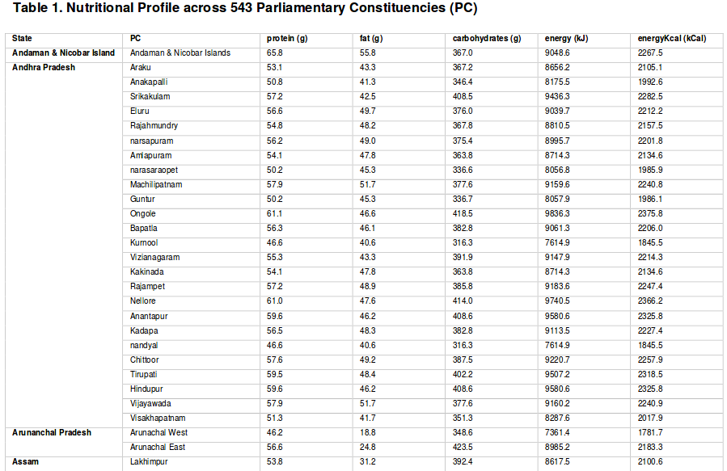

# NFHS4 indicators mapped with Indian Parliamentary Constituencies

Parliamentary constituency factsheet for indicators of nutrition, health, and development in India using NFHS4 data.

Source: https://www.hsph.harvard.edu/population-development/indiapcfactsheets/

PDF: https://cdn1.sph.harvard.edu/wp-content/uploads/sites/1266/1266/20/PC-Factsheet-Nutrition-Health-and-Developmet-Indicators_HCPDS-working-paper_Volume-18_no_4.pdf

# Data

There are 19 tables in total. Currently [data](https://docs.google.com/spreadsheets/d/14ri-R2TAYmPhVhiiJczv9fSe-ahnwCplUW2JPqfpUC8/edit?usp=sharing) has clean data for 4 tables, one in each sheet.

## List of tables

### Sample

## Table content - sample

# Content extraction

I used the excellent [tabula](https://tabula.technology/) software to extract data from PDF tables.

## Data cleaning

- While Tabula can get so close to clean data it is not perfect (that's ok). I spent some effort for each table where tabula couldn't determine the table row format properly (or missed).
- The original PDF didn't seem to mention `Kerala` state as well so it looked as if Kerala constituencies are part of Karnataka. This is fixed.

Please [report](https://github.com/bkamapantula/india-pc-nfhs4/issues/new) if you notice an error.

If you already know a machine-friendly format for this file, please let me know ([add an issue](https://github.com/bkamapantula/india-pc-nfhs4/issues/new)).

# Citation

Blossom J, Kumar R, Kim R, Swaminathan A, Swaminathan G, Rajpal S, Joe W, Subramanian S V. 2019. *Visualizing Parliamentary Constituency Factsheet for Indicators of Nutrition, Health and Development in India*. Cambridge, MA: Harvard Center for Geographic Analysis and Center for Population and Development Studies.

